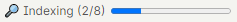
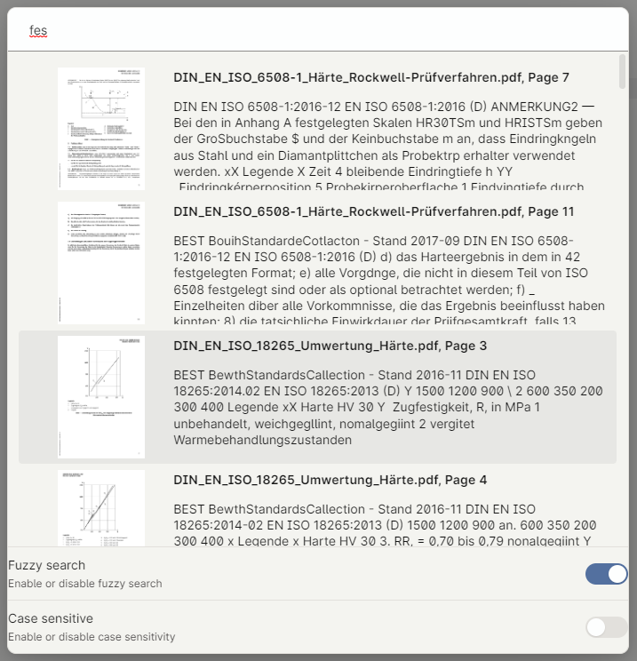
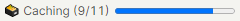

  

  

# **⚠️ Still in early development ⚠️**

## Obsidian OCR

Obsidian OCR allows you to search for text in your images and PDFs

### Installation

#### Dependencies

- `tesseract` for OCR
- `imagemagick` for pdf to png conversion

##### Windows

###### Manual installation

❗Make sure the executables are in your path. If you don't know how look
here: <https://www.architectryan.com/2018/03/17/add-to-the-path-on-windows-10/>❗

- Install [tesseract](https://github.com/UB-Mannheim/tesseract/wiki)
- Install [imagemagick](https://imagemagick.org/index.php)
- If you want to use another language that english, you have to install it manually. (It's really simple)
    - Go to <https://github.com/tesseract-ocr/tessdata_fast/>
    - Download the file for your language (i.e. for German download ger.traineddata)
    - Move to file to `C:\Program Files\Tesseract-OCR\tessdata`

###### Automatic installation

❗The automatic installation features is still in very early development. Expect bugs❗  
ℹ️ Obsidian OCR uses [chocolatey](https://chocolatey.org/) for automatic installation ℹ

- Install & enable the plugin
- Under `settings`, press the `automatic install` button

##### MacOS

- Install tesseract: `brew install tesseract`
- Install tesseract-lang : `brew install tesseract-lang`
- Install imagemagick : `brew install imagemagick`

For the path: check where the binaries are located and add these to "/private/etc/paths"
(I also added them to ~/.zshrc, not sure if that is needed)

- `brew list tesseract`  in my case: `/opt/homebrew/Cellar/tesseract/5.2.0/bin/`
- `brew list tesseract-lang` in my case: `/opt/homebrew/Cellar/tesseract/5.2.0/bin/`
- `brew list imagemagick` in my case: `/opt/homebrew/Cellar/imagemagick/7.1.0-43/bin/`

##### Ubuntu

###### Manual installation

- Run `sudo apt install -y tesseract-ocr imagemagick`
- Install any languages you need by installing the appropriate package (usually named `tesseract-ocr-<lang>`)

###### Automatic installation

❗The automatic installation features is still in very early development. Expect bugs❗

- Install & enable the plugin
- Under `settings`, press the `automatic install` button

##### Arch / Manjaro

- Run `sudo pacman -S tesseract imagemagick`
- Install any languages you need by installing the appropriate package (usually named `tesseract-data-<lang>`)

Note - if Obsidian is running via the Flatpak installation (such as provided by default in Pop!_OS) then this plugin
will not operate. Flatpak sandboxing will change the filepaths so even providing host access will still be problematic.
If you have a Flatpak installation you will need to reinstall via a different method to successfully use this plugin.

#### Plugin installation

- Simply install the plugin from the community plugins

### Usage

- Upon enabling the plugin, you will see a progress bar in the bottom right, indicating that your vault is currently
  being processed.
  
- Upon completion, you can either use the `Search OCR` command or the `magnifying-glass icon` in the ribbon to open the
  search menu.
  
- When adding a new PDF / PNG to your vault, the file is automatically being searched for text.
- Upon starting Obsidian, you will now see another progress bar, indicating that all transcripts are being cached.  
  

### Settings

Obsidian OCR offers a variety of settings you can configure yourself.

|            Name             |                                                           Description                                                           | Default |
|:---------------------------:|:-------------------------------------------------------------------------------------------------------------------------------:|:-------:|
|      Max OCR Processes      |  The maximum amount of ocr processes running at the same time. Increasing this speeds up indexing but also increases cpu usage  |    1    |
|    Max caching processes    | The maximum amount of caching processes running at the same time. Increaing this speeds up caching but also increases cpu usage |   10    |
|          OCR Image          |                                   Decides whether or not images (.png, .jpg, .jpeg) are OCRed                                   |  true   |
|           OCR PDF           |                                          Decides whether or not PDFs (.pdf) are OCRed                                           |  true   |
|        Image density        |            The density of generated PNGs, in dpi. Increasing this helps to OCR smaller text, but increases cpu usage            |   300   |
|        Image quality        |                The quality of generated PNGs. Increasing this helps to OCR smaller text, but increaes cpu usage                 |   98    |
| Additional imagemagick args |                     Additional commandline arguments passed to imagemagick when converting a PDF to PNG(s)                      |         |
|   Additional search paths   |  Additional paths that will be searched when looking for external dependencies. Useful when installing into custom directories  |         |
|        OCR Provider         |                          The OCR provider that will be used. See below for a description of providers                           |  NoOp   |

### OCR Providers

#### List of OCR providers

| Name      | Description                                                                                                                                                          |
|-----------|----------------------------------------------------------------------------------------------------------------------------------------------------------------------|
| NoOp      | The NoOp (no operation) provider does, as the name implies, nothing and is only a dummy provider. To get real OCR capability, you have to switch to another provider |
| Tesseract | OCR provider using [tesseract](https://tesseract-ocr.github.io/) to OCR documents locally on your computer                                                           |

##### Tesseract

By default, tesseract offers two languages to choose from: `eng` and `osd`.

- Osd isn't a language, but rather stands for `Orientation and script detection` and is therefore not useful for our
  use.
- Eng stands for english and should be chosen if your documents are written in english.

ℹ After switching your language, only newly indexed documents use the new language. You can reindex your already added
documents by using the `Delete all transcripts` command ℹ

#### Custom OCR providers

To add a custom OCR provider, create a new class that extends `OCRProvider` and register it
using `OCRProviderManager.registerOCRProviders(new MyCustomProvider())`